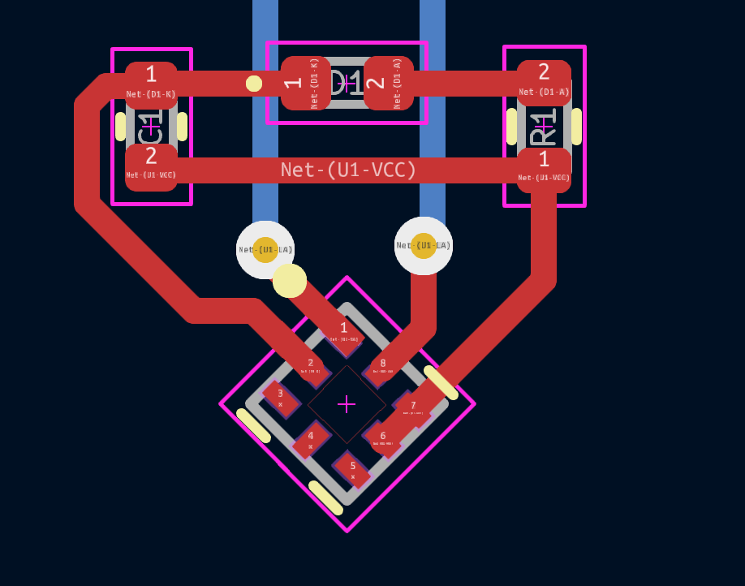

## NFC Business Card
#### Wireless corporate schmuck

## ⇁  Welcome
A business card I made for my course IE1332 Electronic Product Development at KTH.

Feel free to copy my code and designs for your own.

## ⇁  Figures

#### Schematic

#### PCB

#### PCB close up

## ⇁  BOM
| **Id** | **Designator** | **Footprint** | **Quantity** | **Designation** |
| --- | --- | --- | --- | --- |
| 1 | U1 | NT3H1101 | 1 | NT3H1101W0FHKH |
| 2 | R1 | R_0402_1005Metric | 1 | 70Ω |
| 3 | D1 | LED_0402_1005Metric | 1 | LED |
| 4 | C1 | C_0402_1005Metric | 1 | 200nF |
